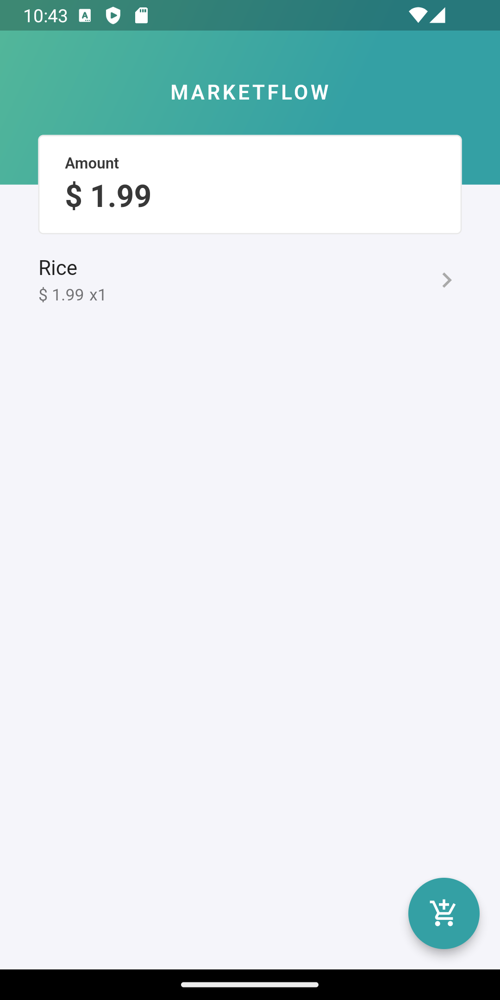

# Marketflow
   
   
   
#### Video Demo:  https://youtu.be/zIaePECo0k8

# Description
An application developed in flutter that allows the user to register products during their purchases in a market.
With marketflow, it is possible to register a product with name, price and quantity, also allowing the user to view all products and the total amount to be paid before reaching the cashier.
The user also has the possibility to edit any detail of a product and also delete it.


# Motivation
I always had problems going to the market, I had to use the calculator on my cell phone to predict my expenses, but this procedure was not at all trivial, I got lost, and I was never sure if I had put a certain amount of each product in the cart and of course I hadn't. the possibility of viewing the unit value of each item, which would help in withdrawing it when the budget ran out...
Thinking about it, I created the marketflow app, in addition to a clean and pleasant look, with it I can add the products properly named, with the right quantity and also the right value, in addition to having the convenience of deleting and even editing a certain product.

## File descriptions
- `lib/pages/home_page.dart`
    - Contains the appbar widget that allows the user to view the sum of the total price of all products listed.
    - Provides a button that allows access to the product creation page.
    - It lists all registered products containing the name, unit price and quantity of each product and also allows access to its editing page.

- `lib/pages/form_page.dart`
    - Provides a form for creating and editing a product where it is possible to register or change the name, price and quantity.

- `lib/pages/splash_screen.dart`
    - Show an animation during app startup.

- `lib/repositories/product_repository.dart`
    - Declares an interface for handling the persistence of a product.

- `lib/repositories/product_repository_memory.dart`
    - Implements the product_repository interface by saving the product in a list (in memory).

- `lib/repositories/product_repository_file.dart`
    - Implements the product_repository interface saving the product in a json file keeping the product saved even when restarting the application.

- `lib/services/cart.dart`
    - Provides a service with an API to read, create, delete and update products.
    - Provide a listener to manage the state of products.

- `lib/models/product.dart`
    - Provides an entity model for creating a product.

- `lib/utils/custom_colors.dart`
    - Contains the application's color palette.

- `lib/widgets/app_bar_widget.dart`
    - Contains the widget that is displayed on the home page to show the total sum of the products' price.

- `lib/widgets/add_product_modal_widget.dart`
    - Changes the quantity of the product and calculates the total price.

- `lib/widgets/quantity_widget.dart`
    - The widget used in the add product modal to increment and decrement the product quantity.

# Get started
## Install requirements
For run this project you need flutter, follow the steps to install flutter: https://docs.flutter.dev/get-started/install

## Get the source
```bash
$ git clone git@github.com:natralia/marketflow.git
```
## Running
```bash
$ cd marketflow
$ flutter run -d <emulator-name>
```